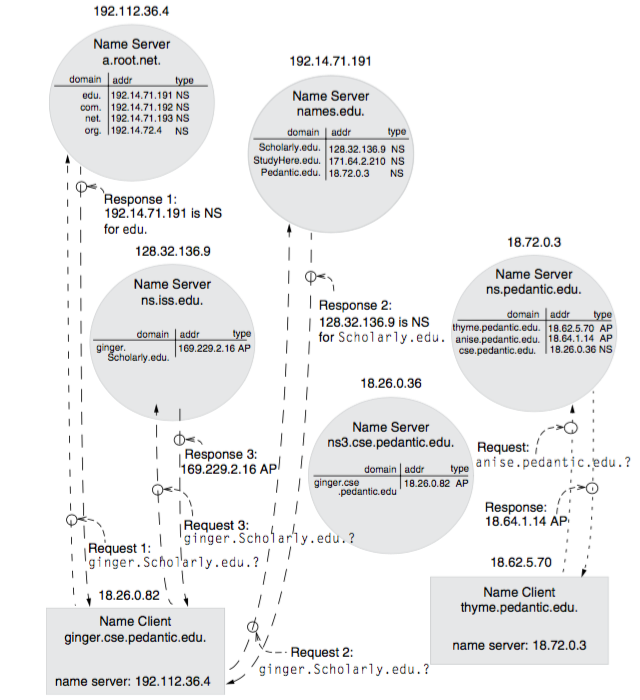

# 6.033: Recitation 2
- **missed recitation 1 bc of snow day**

## Pre-Recitation

### Reading: Section 4.4

Questions to think of while reading:
- What is the benefit of a recursive query?
- What are the benefits of DNS's hierarchical design?
- Are there any drawbacks to DNS's design?

#### 4.4 Case Study: DNS
- Good example of successful implementation of naming scheme
- DNS designed for computer, but is general-purpose name management and name
    resolution sysstem
    - hierarchically distributes management of names among different naming
        authorities
    - hierarchically distributes the job of resolving names to different naming
        servers
- allows rapid responses to requests and provides extreme scalability
- additionally is really resilient to many server and network failures

- __DNS__:
    - associates *domain name* with *internet address*
    - __internet address__:
        - machine-oriented binary identi ers for network attachment points
    - __domain names__:
        - user-friendly character-string names
        - hierarchically structured
        - __domain__: it is simply a set of one or more names that have the
            same hierarchical ancestor
            - can be single attachment point or hierarchical region
        - components seperated by dots
        - least significant component to most significant
        - relative and absolute path names allowed
            - relative path distinguished by trailing dot
                - trailing dot rarely there, DNS_RESOLVE instead applies
                    simple form of multiple lookup

    - typical DNS implementations
        - use text editor, or db manager to manage table of bindings
        - tables loaded onto DNS servers
            - this makes is such that DNS changes aren't immendiate, but can
                take hours to propogate through internet

##### 4.4.1: Name Resolution in DNS

DNS coulda been thought up in three ways:

- __telephone book model__:
    - every network user has a copy of a file containing list of every domain
        name and associated IP
    - downsides:
        - file becomes proportionally larger to # of network users
        - # DNS file changes is positively correlated to larger # of network
            users
            - means as more users are added, file becomes bigger, and more
                changes mean the bigger file needs to be distributed more
                frequently
    - this method was used for nearly 20 years, until replaced with DNS in
        1980s
- __central directory service model__:
    - place single lookup file on one well connected server and have protocol
        for accessing lookup
    - upsides:
        - makes updating easy and fast
    - downsides:
        - one server creates bottleneck
        - tons and tons of concurrency bugs with many updates to one file
        - performance bottelneck
        - you control central server, you control all names
            - doesn't delegate responsibility of assignment in domain names
- __distributed directory service model__:
    - many servers
    - each server responsible for subset of domain names
    - protocol for finding a server that can resolve a particular domain name
    - upside:
        - allows for delgation
        - allows for scaling of requests while maintaining
            - reliability
            - performance
    - more details on protocol:
        - __name server__: maintains set of name records, and associated IP
            - client sends request for name resolutions
            - name server looks through records it's responsible for
                - if server has name record, returns it
            - referrals
                - if server doesn't find record, it looks through referral
                    records
                    - every referral record binds to a hierarchical region of the
                        DNS name space to some other name server
                - most to least significant component of domain name, return
                    referral code for referral that matches domain name most
                    closely
                - if doesn't exist, return domain doesn't exist
        - __authoritative name server__:
            - server that holds name or referall record for domain name
            - examples:
                - `ns3.cse.pedantic.edu` is authoritative for
                    `ginger.cse.pedantic.edu`
                - root name server authoritative for `edu.` while `names.edu`
                    authoritative for all domains ending in `.edu.`
            - name servers don't hold info on their own name, so can't be
                authortative for themselves

__More on DNS Protocol__
1. don't have to send every initial request to root name server
    - DNS_RESOLVE can send to any name server it knows the IP of
    - name server doesn't care where request came from
2. some domain name servers offer __recursive name service__
    - much better resources using cloud network for DNS_RESOLVE, than local network
        - rather have recursive `DNS_RESOLVE` from LTE network, you could have
            name server network doing the `DNS_RESOLVE` procedure
    - if they don't have record, instead of reffering, it resolves name itself
    - forwards initial request to root name server and follows responses til
        resolved name
    - returns desired name record to client
    - with feature 3, provides major performance boost
3. name servers are expected to cache all name records its come across
    - name servers have authorative records, but also cache records
    - increases future access time
    - cache records go out of date, usually based on expiration

##### 4.4.2: Hierarchical Name Management
- __naming authority__: handler of name server
    - may add/remove/change authoritative records to that name server
    - if `com.` authority gave you binding to `jared.com.`
        - then you don't need permission for adding records like
            `mit.jared.com.`, or `hey.jared.com` etc
        - this is because you are naming authority at `jared.com.`, and any
            naming server will eventually request any `jared.com.` to your
            records
##### 4.4.3: Other Features of DNS
- replicating DNS servers
    - DNS requires all organizations that run a service to have at least two
    identical replica servers
    - performance:
        - replicating these name servers becomes important at higher hierarchy levels
        - more people trying to acces `.com` name server than `jared.unique.com` so
        more replicas for `.com.` naming server
    - reliability:
        - generally keep the replicas on seperate networks and far away from
            each other
        - prevents local network and power outages from causing problems
    - DNS_RESOLVE returns list of IP's of valid addresses
        - browser guesses which to follow based on request time, guess of
            location of closest server, etc
- why DNS
    - simple interface
        - take request packet
        - lookup on table
        - send response packet
    - allows personal computer to provide record to anyone
    - small, read-only lookup table allows for easy resetting if power loss
- __synonyms__
    - DNS allows synonyms in the form of indirect names
    - solve two problems
        1. when moving domain names from one IP to another
            - without synonyms:
                - gotta inform everyone there is a new IP for the domain name
                    when change is made
            - with synonyms:
                - inform everyone old machine is at `synonym.com`
                - change servers and inform everyone new server is at
                    `synonym.com`
                - no one knows the difference but you
                - clients still just get a response for an input of domain name
        2. allows you to have one service, with two different domain names
           pointing at it
           - allows choice between godaddy vs domainname.com, and moving
               between seemlessly
           - entire basis of AWS
           - allows multiple names to point to one machine

##### 4.4.4: Name Discovery in DNS
__Name Discovery__
- three places in DNS
    1. client discover name of nearby name server
        - how to discover location of root name servers
            - when first connects to network, performs name discovery
                broadcast
            - internet service provider (ISP) responds with name server
                location
            - terminate discovery by direct communication with local network
                manager to get suitable name server
    2. user discovers name of desired service
        - service names are generally just word of mouth discovery
            - search engines
            - social media
            - email
            - etc. etc.
    3. resolving sytem discovers extensions for unqualified domain names
        - not totally sure about this
            - maybe how to handle bad requests
        - solved with configuration parameter
            - maybe to make it a valid request that will just fail

##### 4.4.5: Trustworthiness of DNS Responses
- shortcoming of DNS
    - no authentication of responses
        - results in easily allowing man in the middle attacks

### Write-up
- What is the purpose of DNS?
    - DNS is a protocol that allows clients to resolve computer addresses from
        domain names.
- How does it work?
    - It works by distributing lookup tables across many name servers
- Why was it designed to work that way?

## Recitation

Karen Sollins - sollins@scail.mit.edu

### Complexity

- client server model
    - model designed to provide modularity
    - gives better seperation of concerns
    - __naming__
        - question: two different way to invoke local call?
            - call by __value__
                - upsides
                    - no interference (mutations to object aren't dangerous)
                - usually will pass by value in distributed environment
            - call by __reference__
                - upsides
                    - no memory
        - names in everday life
            - filenames
            - urls
            - directories

### Naming

#### DNS
- `Record <-- DNS_RESOLVE(value)`
- `DNS_RESOLVE` returns
    - a record
        - types:
            - NS_RECORD
                - name server record
            - RECORD
            - REFERALL
            - CNAME
            - ERROR
            - etc.

#### Design choices:

1. Name Assignment
    - authority: who gets to give names
        - assigning allows for distributed name assignments
        - allowing client to select name requires one central __naming authority__
    - structure/form
        - domain name has hierarchical components
        - human name is set of letters without much form besides common names
2. Name Mapping
    - performance
        - is distributing scalable
            - keeping namine authority constant
        - name mapping procedure fast
    - authority
        - resolution for information
            - who even knows the right mapping
