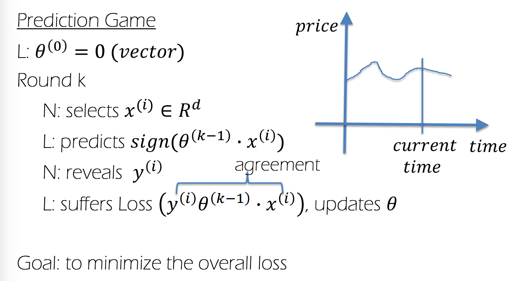
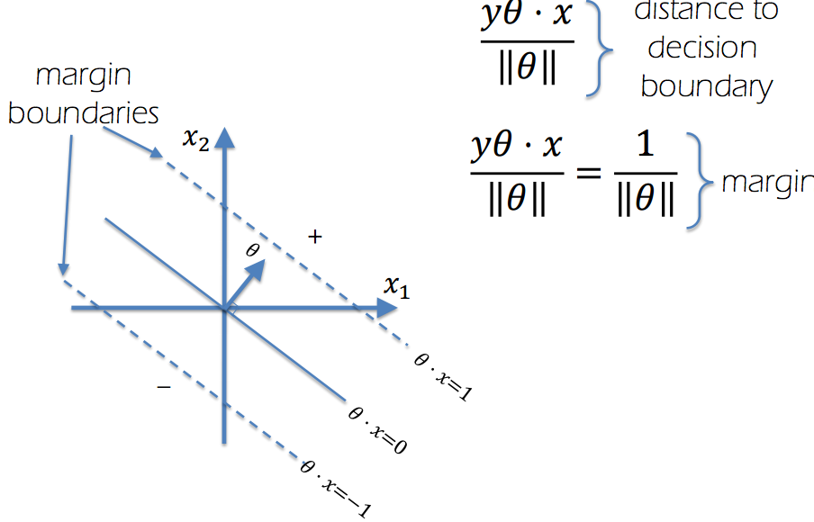
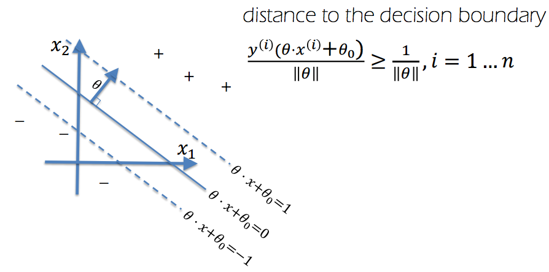

# Lecture 4: Maximum Margin Hyperplane
### Online Algorithms
- stream of data
- use case:
    - prediction algorithm
- an example:
    - graph
        - x-axis: time
        - y-axis: price
    - predict the price at a time given a set of historical data

### Prediction Game

#### Loss functions
__Zero-one loss__:
- bad loss function
- either classifies as good or bad

__Hinge Loss__:

Max margin hyperplane

__See the lecture slides for algorithms__
