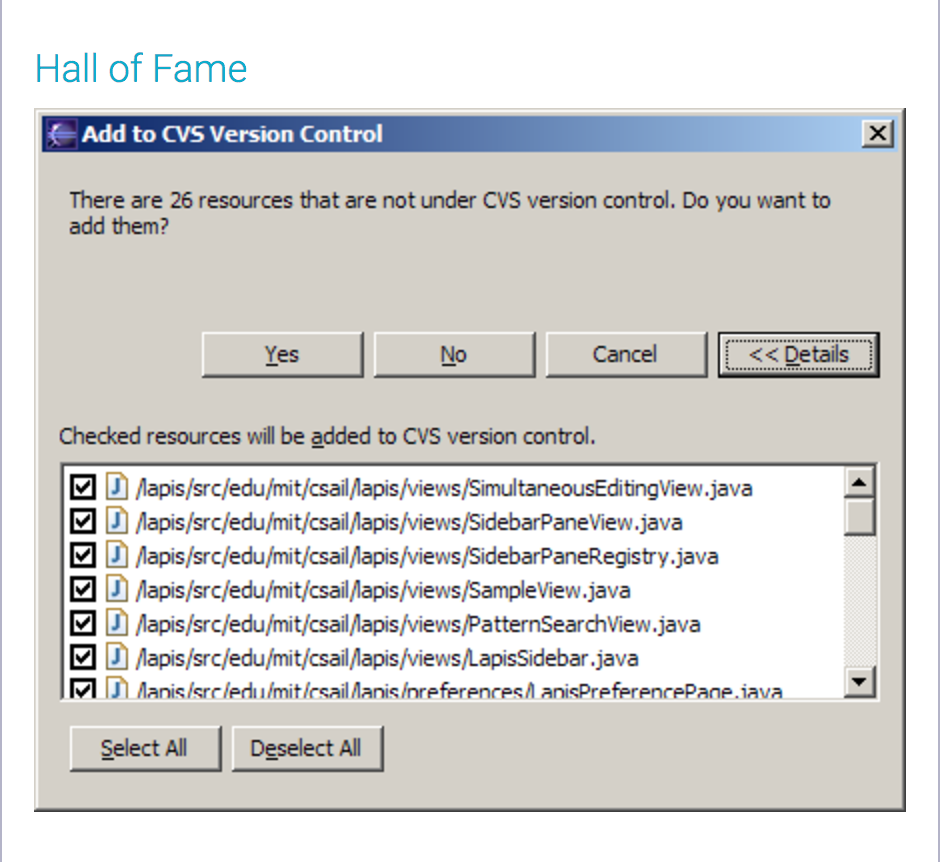

# Lecture 3: Efficiency

## Intro

- not enough info
- give a yes to all or no to all button to improve __efficiency__

### Yes to all, No to all
- extremely useful for efficiency
- with lots of options
    - problem: inefficient when you want yes to all except one
    - solution: put a dialog box and list out options/files etc.
        

## Pointing & Steering

### Fitt's Law
- how fast it takes to move your mouse from one point to another with
    no path constraints
- fitt's laws takeaways
    - edges have infinite clicking space
    - big targets faster get to
    - close targets faster to get to
- in class fitts law experiment
    - takeaways
        - __user moves in straight lines__

### Steering Law

## Chunking
- latest human
